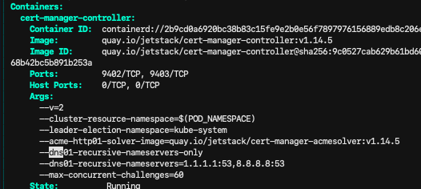

# About

Test-project for certmanager-related stuff. 

Easily create a local kubernetes cluster and install certmanager.

Initially testing overwriting cert manager dns config for faster completion of DNS01 challenges (ref. local/values.yaml)



# Requirements:
  - [Docker](https://docs.docker.com/desktop)
  - [Kind](https://kind.sigs.k8s.io/docs/user/quick-start/#installing-with-a-package-manager)
  - [Ctlptl](https://github.com/tilt-dev/ctlptl)
  - [Kubectl](https://kubernetes.io/docs/tasks/tools/)
  - [Helm](https://helm.sh/docs/intro/install/)
  - Make (Pre-installed in most Linux distributions)


# Set up local environment
**Note:** All `make` commands are ran from root directory of this repository, make sure to clone it to your local environment. 

## Install requirements

Start by installing the [Requirements](#requirements). 

## Create kind cluster 

```sh
make kind
```

This starts up Kind cluster with local registry.

## Install certmanager in the kind cluster
```sh
make certmanager
```

This command will fail if cluster context is not 'kind-kind'.


### Certificates

Tested with Cloudflare DNS.


1. Create api-key secret (`./create-cloudflare-api-secret.sh`) (note: add api-key)
  
    In cloudflare create key with these permissions:
    ```
    nkzk.no (domain) - DNS:Read, DNS:Edit
    ```

2. Create (Cluster)Issuer
   `kubectl apply -f ./issuer.yaml`

3. Create certificate
   `kubectl apply -f ./certificate.yaml`


## Cleanup your local environment

Cleanup/Destroy local environment: 
```sh
`make destroy`
```